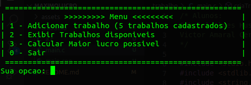
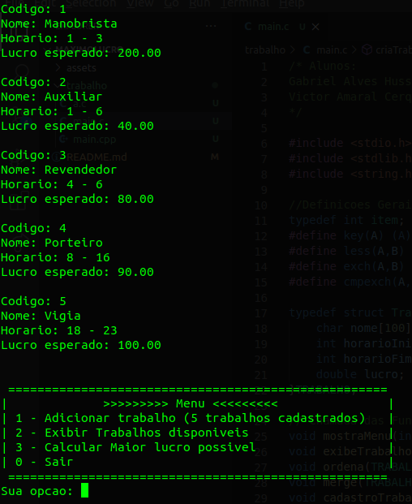
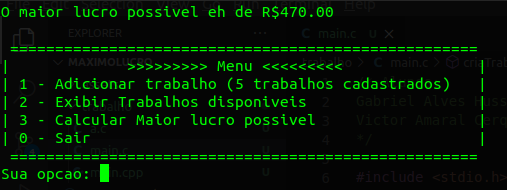

# Maximo Lucro

**Número da Lista**: 5 
**Conteúdo da Disciplina**: Programacao Dinamica - Weighted interval Schedule 

## Alunos
|Matrícula | Aluno |
| -- | -- |
| 17/0103200  |  Gabriel Alves Hussein |
| 17/0164411  |  Victor Amaral Cerqueira |

## Sobre 
Um Freelancer decidiu desenvolveu um aplicativo para organizar sua agenda de trabalho, o objetivo do app eh retornar para o usuario qual seria seu lucro maximo de acordo com os trabalhos disponiveis para ele realizar, assim como quais trabalhos estariam envolvidos em seu lucro maximo.

## Screenshots

## Instalação 
**Linguagem**: C++ 

## Uso 
Compilar o arquivo main.c com o comando "g++ -o a.c main.c"
Executar o arquivo a.c com o comando "./a.c"
